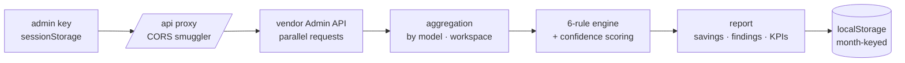

```
 ████████╗ ██████╗ ██╗  ██╗███████╗███╗   ██╗██████╗ ██╗██╗      ██████╗ ████████╗
 ╚══██╔══╝██╔═══██╗██║ ██╔╝██╔════╝████╗  ██║██╔══██╗██║██║     ██╔═══██╗╚══██╔══╝
    ██║   ██║   ██║█████╔╝ █████╗  ██╔██╗ ██║██████╔╝██║██║     ██║   ██║   ██║
    ██║   ██║   ██║██╔═██╗ ██╔══╝  ██║╚██╗██║██╔═══╝ ██║██║     ██║   ██║   ██║
    ██║   ╚██████╔╝██║  ██╗███████╗██║ ╚████║██║     ██║███████╗╚██████╔╝   ██║
    ╚═╝    ╚═════╝ ╚═╝  ╚═╝╚══════╝╚═╝  ╚═══╝╚═╝     ╚═╝╚══════╝ ╚═════╝    ╚═╝
```

<div align="center">

### `SEE EVERYTHING. TOUCH NOTHING. SAVE THOUSANDS.`

_an LLM spend auditor that reads your Admin API and tells you where the money leaks_


-3fb950?style=flat-square&labelColor=111111>)

</div>

---

## 💸 What is this

Most teams discover their LLM bill the way you discover a parking ticket.
TokenPilot reads your **Anthropic and OpenAI Admin APIs**, runs your actual
token volumes through a **6-rule detection engine**, and hands back
confidence-scored savings recommendations in about 60 seconds. No theoretical
benchmarks — every dollar figure is computed from _your_ usage.

Everything runs client-side. Your API key lives in `sessionStorage`, dies when
the tab does, and never gets sent anywhere except the vendor it belongs to.

```console
nick@tokenpilot:~$ audit --vendor anthropic
[✓] 6 rules executed. 4 findings. estimated waste: not zero.
[i] your keys stayed in this tab. as is tradition.
```

## 🔍 The detection engine

| #   | rule                       | what it actually catches                                       |
| --- | -------------------------- | -------------------------------------------------------------- |
| 01  | **model downgrade**        | tasks burning a frontier model that a cheaper one handles fine |
| 02  | **RAG context bloat**      | prompts hauling around more context than the answer needs      |
| 03  | **missing prompt caching** | repeated prefixes paying full price on every single call       |
| 04  | **batch API opportunity**  | non-urgent volume that could ride the 50%-off batch lane       |
| 05  | **quality upgrade**        | the reverse case — places a smarter model would pay for itself |
| 06  | **legacy model usage**     | deprecated models quietly costing more for less                |

Each finding gets **multi-signal confidence scoring** — volume, consistency,
active days, temporal patterns — so only optimizations proven by your own data
make the report. Conservative estimates, high-confidence wins first.

## 🧾 Dual-vendor support

| vendor        | what gets analyzed                                                                                                            |
| ------------- | ----------------------------------------------------------------------------------------------------------------------------- |
| **Anthropic** | organizations, workspaces, all Claude models, prompt-caching detection                                                        |
| **OpenAI**    | projects, multi-service usage (completions, audio, images, embeddings, vector stores, code interpreter), actual cost tracking |

## 🚀 Run it

Requires **Node.js 22+** and **npm 10+**, plus a read-only Admin API key —
Anthropic ([create one](https://console.anthropic.com/settings/keys), starts
with `sk-ant-admin-`) or OpenAI ([create one](https://platform.openai.com/api-keys),
starts with `sk-admin-`).

```bash
git clone https://github.com/nitrimandylis/tokenpilot.git
cd tokenpilot
npm install
npm run dev        # → http://localhost:3000
```

Pick a vendor, paste the key, click **Get Report**. Then browse findings by
severity, spend by workspace, and history by month. The key is forgotten the
moment you close the tab — TokenPilot has the memory of a goldfish, on purpose.

There's also a `mock-server/` for developing without burning real API calls.

## 🔩 Under the hood



| layer     | tech                          | job                                                  |
| --------- | ----------------------------- | ---------------------------------------------------- |
| framework | Next.js 16 (App Router)       | pages for analysis, history, analytics, raw data     |
| language  | TypeScript 5.8 strict         | because money math deserves types                    |
| UI        | React 19 + Tailwind CSS 4     | severity filters, spend breakdowns, month navigation |
| state     | React Query 5 + Context       | async vendor calls, in-memory key handling           |
| storage   | localStorage / sessionStorage | analyses persist locally; keys don't persist at all  |
| ids       | ULID                          | sortable, unique, no coordination needed             |

Pre-commit: Husky + lint-staged run Prettier on everything. Full architecture
notes live in `CLAUDE.md`.

```bash
npm run dev          # dev server
npm run build        # production build
npm run lint         # Next.js ESLint
npm run type-check   # tsc, no emit
npm run format       # Prettier
```

## 🔒 Security & privacy

- **No telemetry, no tracking** — the only spying happening is on your bill
- **Read-only Admin API access** — zero mutations, ever
- **Client-side processing** — nothing transmitted to anyone but your vendor
- **Open source** — audit the auditor

---

<div align="center">

**[Nick Trimandylis](https://github.com/nitrimandylis)**

`THE CHEAPEST TOKEN IS THE ONE YOU DIDN'T SEND`

MIT licensed.

</div>
