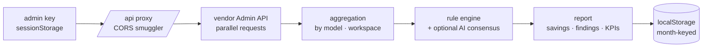

```
 ████████╗ ██████╗ ██╗  ██╗███████╗███╗   ██╗██████╗ ██╗██╗      ██████╗ ████████╗
 ╚══██╔══╝██╔═══██╗██║ ██╔╝██╔════╝████╗  ██║██╔══██╗██║██║     ██╔═══██╗╚══██╔══╝
    ██║   ██║   ██║█████╔╝ █████╗  ██╔██╗ ██║██████╔╝██║██║     ██║   ██║   ██║
    ██║   ██║   ██║██╔═██╗ ██╔══╝  ██║╚██╗██║██╔═══╝ ██║██║     ██║   ██║   ██║
    ██║   ╚██████╔╝██║  ██╗███████╗██║ ╚████║██║     ██║███████╗╚██████╔╝   ██║
    ╚═╝    ╚═════╝ ╚═╝  ╚═╝╚══════╝╚═╝  ╚═══╝╚═╝     ╚═╝╚══════╝ ╚═════╝    ╚═╝
```

<div align="center">

### `SEE EVERYTHING. TOUCH NOTHING. SAVE THOUSANDS.`

_an LLM spend auditor that reads your Admin API and tells you where the money leaks_


-3fb950?style=flat-square&labelColor=111111>)

</div>

---

## 💸 What is this

Most teams discover their LLM bill the way you discover a parking ticket.
TokenPilot reads your **Anthropic and OpenAI Admin APIs**, runs your actual
token volumes through a **19-rule detection engine** (7 Anthropic, 12 OpenAI),
and hands back confidence-scored savings recommendations in about 60 seconds.
No theoretical benchmarks — every dollar figure is computed from _your_ usage.

Everything runs client-side. Your API key lives in `sessionStorage`, dies when
the tab does, and never gets sent anywhere except the vendor it belongs to.

```console
nick@tokenpilot:~$ audit --vendor anthropic
[✓] 7 rules executed. 4 findings. estimated waste: not zero.
[i] your keys stayed in this tab. as is tradition.
```

## 🔍 The detection engine

| #   | rule                         | what it actually catches                                       |
| --- | ---------------------------- | -------------------------------------------------------------- |
| 01  | **model downgrade**          | tasks burning a frontier model that a cheaper one handles fine |
| 02  | **RAG context bloat**        | prompts hauling around more context than the answer needs      |
| 03  | **missing prompt caching**   | repeated prefixes paying full price on every single call       |
| 04  | **cache-write waste**        | caches written at a 25% premium, then invalidated before reuse |
| 05  | **batch API opportunity**    | bursty _or_ steady non-urgent volume missing the 50%-off lane  |
| 06  | **prompt bloat**             | verbose prompts where a trim saves real input tokens           |
| 07  | **reasoning-model overkill** | o-series reasoning premiums spent on non-reasoning work        |
| 08  | **quality upgrade**          | the reverse case — places a smarter model would pay for itself |
| 09  | **legacy model usage**       | deprecated models quietly costing more for less                |

Each finding gets **multi-signal confidence scoring** — volume, consistency,
active days, temporal patterns — and carries its **signal trail** ("based on:
avg output < 80 tok, 500+ requests…") so you can see exactly why it fired.
Savings per row are capped at what the row actually spends. Conservative
estimates, high-confidence wins first.

## 🤝 AI augmentation (optional)

Set `NIM_API_KEY` server-side and a toggle appears that layers an LLM
(NVIDIA NIM, `llama-3.3-70b` by default) **on top of** the rules — never
instead of them:

- both engines run; findings merge with per-finding provenance — `Rules`,
  `AI-spotted`, or `Rules + AI` when they agree (agreement raises confidence)
- the model **detects and explains only. it never prices anything** — every
  dollar figure comes from the same deterministic costing formulas the rules
  use, computed from your real token volumes
- proposals outside the fixed category set are dropped on arrival
- NIM down? the report degrades to rules-only with a notice. never empty

The report footer shows what the AI call itself cost next to what it found —
the auditor audits itself.

## 🧾 Dual-vendor support

| vendor        | what gets analyzed                                                                                                            |
| ------------- | ----------------------------------------------------------------------------------------------------------------------------- |
| **Anthropic** | organizations, workspaces, all Claude models, prompt-cache read _and_ write efficiency                                        |
| **OpenAI**    | projects, multi-service usage (completions, audio, images, embeddings, vector stores, code interpreter), actual cost tracking |

## 🚀 Run it

Requires **Node.js 22+** and **npm 10+**, plus a read-only Admin API key —
Anthropic ([create one](https://console.anthropic.com/settings/keys), starts
with `sk-ant-admin-`) or OpenAI ([create one](https://platform.openai.com/api-keys),
starts with `sk-admin-`).

```bash
git clone https://github.com/nitrimandylis/tokenpilot.git
cd tokenpilot
npm install
npm run dev        # → http://localhost:3000
```

Pick a vendor, paste the key, click **Analyze**. Then browse findings by
severity, spend by workspace, and history by month. The key is forgotten the
moment you close the tab — TokenPilot has the memory of a goldfish, on purpose.

No key handy? **Try with sample data** conjures a fresh fake org on every
click — pick a sprawling enterprise (every rule fires, spend compounding
month over month, one runaway-agent incident in the middle) or a lean startup
(barely anything to fix, on purpose). Each run stays internally coherent:
one org, one story, across all six months. There's also a `mock-server/`
for developing without burning real API calls.

## 🔩 Under the hood


```mermaid
flowchart LR
    A[admin key<br/>sessionStorage] --> B[/api proxy<br/>CORS smuggler/]
    B --> C[vendor Admin API<br/>parallel requests]
    C --> D[aggregation<br/>by model · workspace]
    D --> E[rule engine<br/>+ optional AI consensus]
    E --> F[report<br/>savings · findings · KPIs]
    F --> G[(localStorage<br/>month-keyed)]
```

| layer     | tech                          | job                                                  |
| --------- | ----------------------------- | ---------------------------------------------------- |
| framework | Next.js 16 (App Router)       | pages for analysis, history, analytics, raw data     |
| language  | TypeScript 5.8 strict         | because money math deserves types                    |
| UI        | React 19 + Tailwind CSS 4     | severity filters, spend breakdowns, month navigation |
| state     | React Query 5 + Context       | async vendor calls, in-memory key handling           |
| storage   | localStorage / sessionStorage | analyses persist locally; keys don't persist at all  |
| ids       | ULID                          | sortable, unique, no coordination needed             |

Pre-commit: Husky + lint-staged run Prettier on everything; commitlint guards
the messages. A vitest suite (96 tests) pins the money math — every costing
formula, the consensus merge, and the demo generators' purity. Full
architecture notes live in `CLAUDE.md`.

```bash
npm run dev          # dev server
npm run build        # production build
npm run lint         # ESLint
npm run type-check   # tsc, no emit
npm run format       # Prettier
npm test             # vitest — the money math
```

## 🔒 Security & privacy

- **No telemetry, no tracking** — the only spying happening is on your bill
- **Read-only Admin API access** — zero mutations, ever
- **Client-side processing** — nothing transmitted to anyone but your vendor
- **AI augmentation is opt-in and key-free** — off unless the server operator
  configures NIM; when on, it receives aggregated per-model token counts only.
  never your API key, never your prompts (TokenPilot never sees those either)
- **Open source** — audit the auditor

---

<div align="center">

**[Nick Trimandylis](https://github.com/nitrimandylis)**

`THE CHEAPEST TOKEN IS THE ONE YOU DIDN'T SEND`

AGPL-3.0 licensed.

</div>
